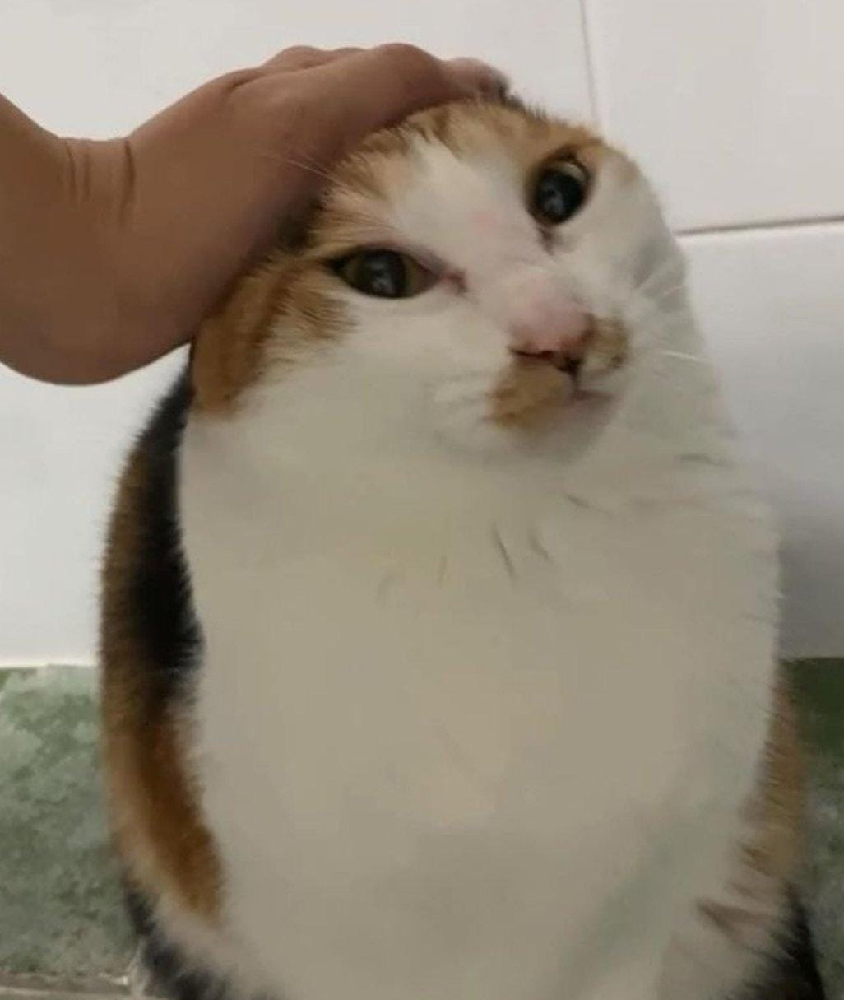

<h1>🐤 Hello there! I'm Nicolas Vera 🐤</h1>

<h2>a Software Developer from Argentina. </h2>
<h3>Professional Nap Taker 😴 Mate Enjoyer 🧉</h3>
<h3> Nowadays... </h3>

- 🏋️‍♀️ I’m currently working on CafeChipa MDP, a coffee and snacks blog for me and my friends.
- 🎬 I’m currently learning to use react-spring and React Native Animations.
- 🥳 I really like to collaborate and build beautiful UIs so let's have a chat!

I've been working as a software developer for about two years now and along the way I found out two things, I really love programming and I truly enjoy working in the frontend.
     One thing I'd like to achieve as the time goes by, is to become really good at CSS and JavaScript animations. The things you can create with the bare basics are incredible.

<!--
**queondatodotranqui/queondatodotranqui** is a ✨ _special_ ✨ repository because its `README.md` (this file) appears on your GitHub profile.

Here are some ideas to get you started:

- 🤔 I’m looking for help with ...
- 💬 Ask me about ...
- 📫 How to reach me: ...
- 😄 Pronouns: ...
- ⚡ Fun fact: ...
-->
